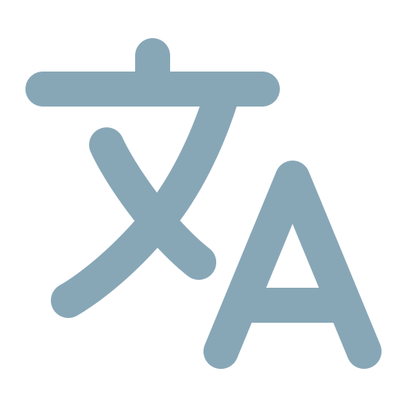

# 

###### Graphic generated by [readme-typing-svg](https://git.io/typing-svg 'Github Link'). Check it out for yourself and star it if you liked! . Confira você mesmo e apoie o autor, caso tenha gostado!')

---

This github repository is a personal space to showcase my portfolio, alongside the projects, skills and experiences developed throughout this brief journey. 

Okay, mas brincadeiras a parte, atualmente atuo como Bolsista de Suporte num conceituado laboratório chamado [LEAD](https://leadfortaleza.com.br), baseado em Fortaleza, Ceará 📍. O Lead surgiu de um convênio entre a [Universidade Estadual do Ceará](https://www.ufc.br/a-universidade) e a empresa [Dell](https://www.dell.com/pt-br/dt/corporate/about-us/who-we-are.htm), visando formular soluções tecnológicas que amparem indivíduos portadores de deficiência visual, auditiva, física, intelectual e cognitiva.

## Available Languages 

- 🔭 Como supracitado, atualmente estou em busca de me graduar como bacharel em Sitemas e Mídias Digitais na .
- 💻 Sou bolsista de suporte num laboratório de pesquisa e estou procurando uma chance de embarcar oficialmente no mercado de Desenvolvimento FrontEnd/BackEnd/FullStack, sem deixar meus projetos pessoais de lado, se possível.
- 📈 Pra este ano de 2025, tenho dois objetivos bem simples, o primeiro deles sendo mergulhar em mais tecnologias úteis que complementem o que já vi, como Ruby e Ruby on Rails, Selenium, quem sabe até algo relacionado a sistemas embarcados.
- ✌️ O segundo objetivo é me tornar um desenvolvedor FullStack, mas não só isso, quero muito dar de volta à comunidade todo o apoio que consegui acumular nos últimos meses em que tive um crescimento exponencial, então nada me deixaria mais orgulhoso do que ver essas estatísticas expostas aqui embaixo aumentando cada vez mais ao longo do ano. ❤️

###### Currently the whole repo is under development, so some links may lead to unfinished documents or sections. Please be patient as I work on improving the content! 

## 💫 About Me:

🔭 Currently expanding my tech stack with some exciting recent additions: Svelte, Astro, and diving deep into embedded systems (mainly Arduino and MicroPython). Always building and learning something new.

👯 Looking to collaborate on social projects that promote open-source environments and raise awareness about both the benefits and warning signs in AI development progress.

🤝 Happy to help localize, promote, or expand projects by adding regional flavor to content. Celebrating different cultures feels especially important in these troubled times.

🌱 Finally getting around to learning TypeScript (better late than never!). I believe progress matters more than reaching the destination quickly.

⚡ Fun fact: I'm currently writing a university article on mental health among teenagers and young adults within digital social bubbles.

💬 Feel free to discuss any of these topics with me. As Orwell noted in 1984: "In Newspeak there is no word for 'Science.'" [Maybe it's time for all of us to push back against the party.](https://marioamaggioni.wordpress.com/2015/03/06/science-and-the-principles-of-newspeak-by-george-orwell/#:~:text=branches%2E-,There,blasphemy)

---

### 🌐 Socials:

  

---

### 💻 Tech Stack:

<b>Programming / Markup Languages</b>

<b>Front-End Frameworks & Libraries</b>

<b>Back-End Frameworks</b>

<b>Styling and UI</b>

<b>Databases</b>

<b>Dev Tools</b>

<b>Hosting and Cloud Computing</b>

<b>Design</b>

<b>Embedded Systems</b>

---

### 📊 GitHub Stats:

---

### 🏆 GitHub Trophies

---

### ✍️ Random Dev Quote

---

### 🔝 Top Contributed Repo

---

###### Proudly created with [GPRM]( https://gprm.itsvg.in )

